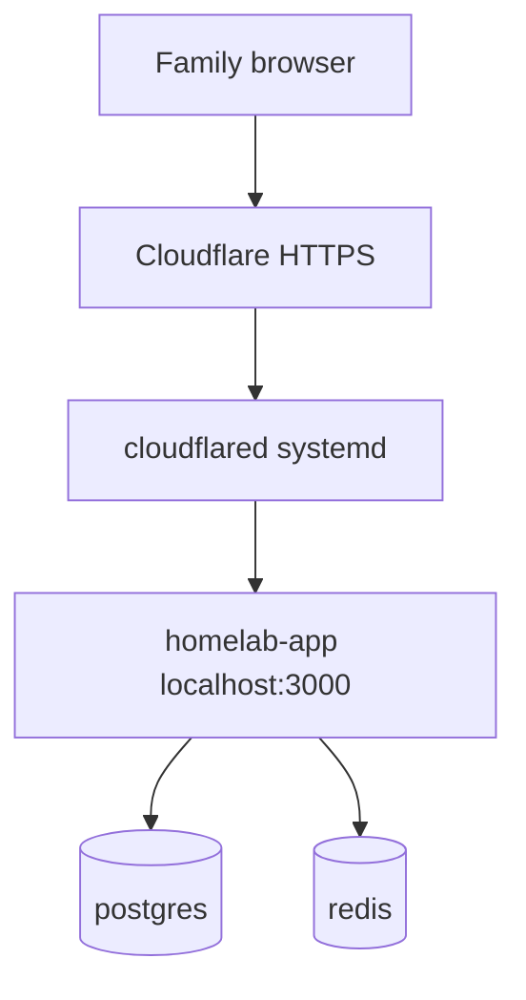

# Design Spec: Ubuntu + Cloudflare Easy Install

**Date:** 2026-06-27  
**Status:** Implemented  
**Project:** Family Home Portal

## Mission

Production-ready homelab deployment on blank Ubuntu VPS with HTTPS via Cloudflare Zero Trust Tunnel (cloudflared). No public port 3000. Git-based deploy without copying `node_modules`.

## Architecture

## Components

| Component | Path | Purpose |
|-----------|------|---------|
| Setup entry | `scripts/setup-ubuntu.sh` | One-command blank VPS install |
| Docker install | `scripts/install-docker.sh` | Idempotent Docker via get.docker.com |
| Cloudflared | `scripts/install-cloudflared.sh` | Token-based tunnel service |
| Env generator | `scripts/configure-env.sh` | Creates `.env` with SESSION_SECRET + APP_URL |
| Health wait | `scripts/wait-health.sh` | Polls `/api/health` post-deploy |
| Deploy | `scripts/deploy-vps.sh` | git pull + rebuild |
| Reinstall | `scripts/reinstall-vps.sh` | Fresh clone, keeps volumes |
| Windows deploy | `deploy.ps1` | git push + SSH deploy-vps |
| Config template | `.deploy.env.example` | VPS_HOST, APP_DOMAIN |

## Docker changes

- `env_file: .env` on app service
- `127.0.0.1:3000:3000` bind (tunnel only)
- Required `SESSION_SECRET` and `APP_URL` in `.env`
- Healthcheck with `start_period: 40s`

## Security

- UFW: OpenSSH only; app not publicly exposed
- cloudflared outbound to Cloudflare
- TOTP auth, per-user file isolation unchanged

## Reliability

- `/api/health` checks PostgreSQL (503 if down), reports Redis status
- Migrations run with `ON_ERROR_STOP=1`, idempotent `0000_init.sql`
- Deploy scripts wait for health before declaring success

## Out of scope

- Automated Cloudflare dashboard provisioning
- New family product features
- Full user admin UI
- Host `/proc` mounts for monitoring (future)

## Success criteria

- [x] Blank Ubuntu → HTTPS portal via documented flow
- [x] No hardcoded VPS IP in repo
- [x] Russian QUICKSTART under 2 pages equivalent
- [x] npm run build + lint pass
